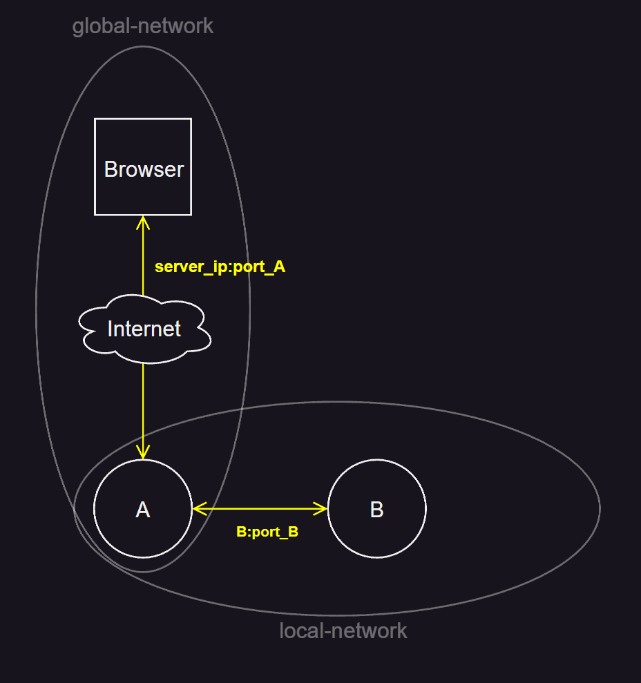

# Repository description
An example of how to isolate a docker container from outside influence

## Applications desciption
Node was used to implement two applications: `appA` and `appB`. When opening the `appA` page, data from `appB` will be requested

## Network isolation
- Application `appA` forwards port `3000` to the outside and becomes accessible from the outside - the `global_network` network is used
- The `appB` application has port `3001`, but does not forward the port to the outside

Applications `appA` and `appB` are on the same `local_network`, so they can communicate with each other by name
For example `appA` accesses `appB` at: `http://appB:3001`

## Diagram


## Usage
Repositiory uses docker-compose to build:
```bash
docker compose up -d --build
```
To open the page need to get `SERVER_IP` where containers are located and follow the link:
```
SERVER_IP:3000
```
